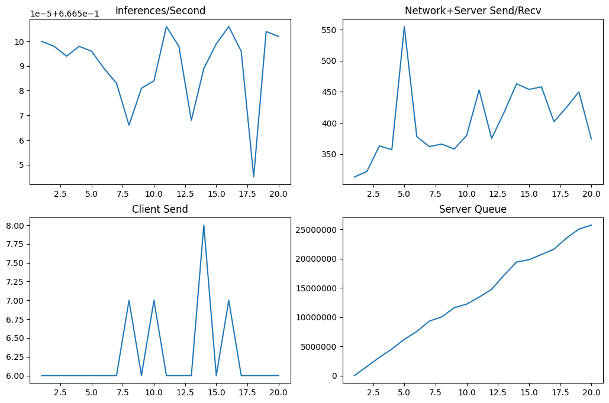
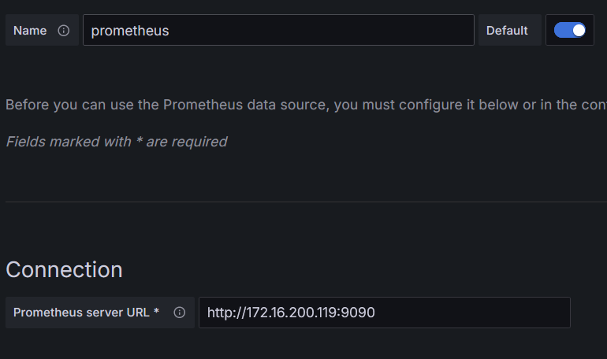

# Triton-Inference-Server
Requirements : Docker Container, GPU device, Linux OS  
## 1. Model
Model : Bloom_560m    
[🤗Hugging Face - BLOOM_560m](https://huggingface.co/bigscience/bloom-560m?library=true)

## 2. Model Repository & Configurations
### Repository 구성
Triton Inference Server의 기본적인 모델 리포지토리는 다음과 같은 형식으로 구성한다.
```bash
model_repository
│
└── bloom-560m #모델명
    ├── config.pbtxt #모델 config
		└── 1 #모델 버전
        └── model.py #모델 저장위치
```

### Model 파일
model.py는 모델을 지정해주는 것으로 사용할 Python Backend를 사용할 지 py 파일을 넣는다.  
(상세 코드는 [model.py](/model_repository/bloom-560m/1/model.py) 참조)
```python
class TritonPythonModel:
    def initialize(self, args):
        self.generator = pipeline("text-generation", model="bigscience/bloom-560m", device = 0)

    def execute(self, requests):
            ....

    def finalize(self, args):
         self.generator = None
```
### Config 파일
Auto-configuration이 지원되지 않는 모델 포맷이라면 config.pbtxt를 생성하여 작성한다.  
(상세코드는 [config.pbtxt](/model_repository/bloom-560m/config.pbtxt) 참조)
```yaml
name : "bloom-560m"
backend : "python"
max_batch_size : 0
input [
    ...
]
output [
    ...
]
instance_group [
    ...
]
```
## 3. Triton Inference Server 실행
Triton Server에 필요한 라이브러리를 설치하기 위해 `dockerfile`파일을 이용한다.
버전과 라이브러리를 작성한 뒤에 `build` 커맨드를 통해 빌드한다.
```yaml
# Dockerfile
FROM nvcr.io/nvidia/tritonserver:24.01-py3
RUN pip install transformers torch

# build command
docker build -t triton_image .
```
shell에 아래 커맨드를 입력해서 도커 이미지를 실행시킨다.
```bash
docker run --gpus all --name triton_server --rm -p8000:8000 -p8001:8001 -p8002:8002 -v /home/linux/model_repository/:/models triton_image tritonserver --model-repository=/models
```
## 4. Request Inference LLM Model
Python 혹은 cURL 등으로 Inference를 한다.  
(상세코드는 [run_inference.ipynb](/run_inference.ipynb) 혹은 [run_inference.py](/run_inference.py) 참조)
```python
import requests

url = 'http://localhost:8000/v2/models/bloom-560m/infer'

sentence = [ "입력 텍스트" ]
data = {
    'inputs': [
        ...
    ],
    'params.': [
        ...
    ]
}
response = requests.post(url, json=data)
answer = response.json()
print(answer)
print('\n 👻', answer['outputs'][0]['data'])
```
py로 작성한 파일은 `python3 run_inference.py`를 통해 Inference할 수 있다.
## 5. 모델 추론 성능 수치화
Triton sdk에 내장된 Perf Analyzer를 통해 모델의 Inferencing 성능을 테스트를 해서 측정할 수 있다.
```bash
$ docker run --rm --net=host -it --name triton_sdk \
-v /home/linux/perf_results/:/workspace/ \
nvcr.io/nvidia/tritonserver:24.01-py3-sdk bash
```
아래 커맨드를 통해 총 20개까지의 테스트 추론을 단계적으로 늘리면서 추론한다.  
최종적으로 나온 결과는 perf_results.csv 파일로 저장된다.
```bash
$ perf_analyzer -m bloom-560m -u localhost:8001 -i grpc --concurrency-range 1:20 --input-data random --shape=input:5 --max-trial 5 --string-length=10 -f perf_results
```
## 6. 모델 추론 성능 시각화
csv파일을 통해 얻어진 결과 데이터프레임으로 표를 쉽게 작성할 수 있다.
```python
perf_df = pd.read_csv("/home/linux/perf_results/perf_results.csv", index_col=0).sort_values(by='Concurrency')
perf_df

fig, (ax1, ax2) = plt.subplots(2, 2, figsize=(12.5,8))
plt.ticklabel_format(axis='y', useOffset=False, style='plain')

#지표 4개만 표시, 테스트 결과는 12개의 지표를 포함
for i in list(range(0, 4)):
    subplot = eval(f'ax{ i % 2 + 1}')[0 if i < 2 else 1]
    subplot.plot(perf_df.iloc[:,i])
    subplot.set_title(perf_df.iloc[:,i].name)
```
<p align='center'>  </p>

## 7. Triton Server 모니터링
Prometheus와 Grafana 도커 컨테이너를 이용해 Triton server가 내보내는 매트릭스를 연결해 실시간으로 모니터링이 가능하다. 
`prometheus.yml`을 아래처럼 작성한다.
```yaml

global:
   scrape_interval: 15s
scrape_configs:
 - job_name: 'prometheus'
   static_configs:
           - targets:
                 - 123.456.789.000:8002 # Triton이 작동하고 있는 IP, 8002번 매트릭스 포트
```
### Prometheus
Prometheus 연결을 위한 도커 네트워크를 생성 후 진행한다.
```bash
docker network create mynetwork

docker run --network=mynetwork -p 9090:9090 -v /home/linux:/etc/prometheus/ --name prometheus -d prom/prometheus --config.file=/etc/prometheus/prometheus.yml

curl http://localhost:9090
 ```
 ### Grafana
 ```bash
docker run --network=mynetwork -d --name=grafana -p 3000:3000 grafana/grafana

curl http://localhost:3000
 ```
 Grafana에 Prometheus를 연결하여 모니터링 지표를 연동한다.

<p align='center'>  </p>

### Grafana Dashboard
사진에 나타난 것 외에도 더 많은 리소스 매트릭스를 관리할 수 있다.

<p align='center'>  </p>